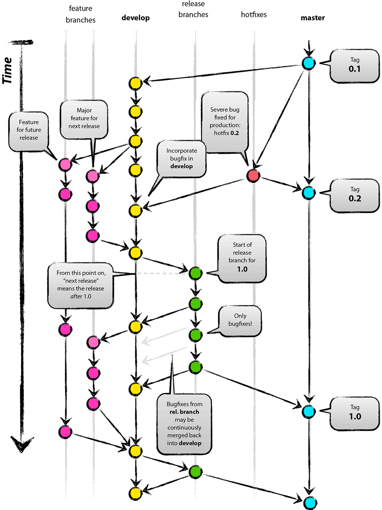

# Description: Training Project Diary

### [27-July-2020 - Day 01]
* Training Setup
    - [x] GitLab setup task
          - Add SSH key to gitlab github(personal profile gmail)
          - Add necessary info about **username and path details**  in `config file`
          - Clone the perfios-training repo from master
    - [X] Download  and install IDE(intelij and pycharm)
### [28-July-2020 - Day 02]
* Markdown
    - Learnt different Git commands
    - Pushed the markdown exercise
* Git Commands
```
      - add - stages the files selected in the index for commit.
      - checkout - can be used to checkout to another branch.
      - clone - Clones remote repo to local repo
      - commit - commiting files into the local repo. Cannot commit without message.
      - config - It is a convenience function that is used to set Git configuration values on a global or local project level. 
      - gitignore - When deciding whether to ignore a path, Git normally checks gitignore patterns from multiple sources
      - gitk - gitk is a graphical history viewer. Think of it like a powerful GUI shell over git log and git grep.
      - init - initialize a git repository
      - log - log of all commands and Operations
      - merge - Git merge will combine multiple sequences of commits into one unified history. In the most frequent use cases, git merge is used to combine two branches
      - pull - pulls the content of central repo to the local repo.
      - push - Pushing files from local to remote repository
      - remote - With no arguments, shows a list of existing remotes. 
      - stash - The command saves your local modifications away and reverts the working directory to match the HEAD commit.
      - status - status of current branch
      
  
  ```
  * Best practices (Before pushing changes to remote anvitha)
  ```
  git checkout develop          # from local anvitha to local develop
  git branch -a                 # to view all branches present locally and remotely
  git fetch origin              # git pull origin (remote develop) can be used for 
  git merge origin              # these 2 steps
  git checkout anvitha        # local anvitha
  git merge develop             # with local branch develop
  git status
  git push origin anvitha     # remote aniruddha

  ```
  
### [29-July-2020 - Day 03]


* Different scenarios of merge conflicts and how to resolve them 
* Clone Repository
       - DeveloperNotes2Myself
       - UnixNotes2Myself
       

### [30-July-2020 - Day 04]
 * Unix commands
     - cp
     - bc
     - cal
     - chmod
     - chown
     - cksum
     - curl
     - cut
     - date  and other UNIX commands
     
### [31-July-2020 - Day 05]
* solving Git exercise 
* solving Unix exercise

